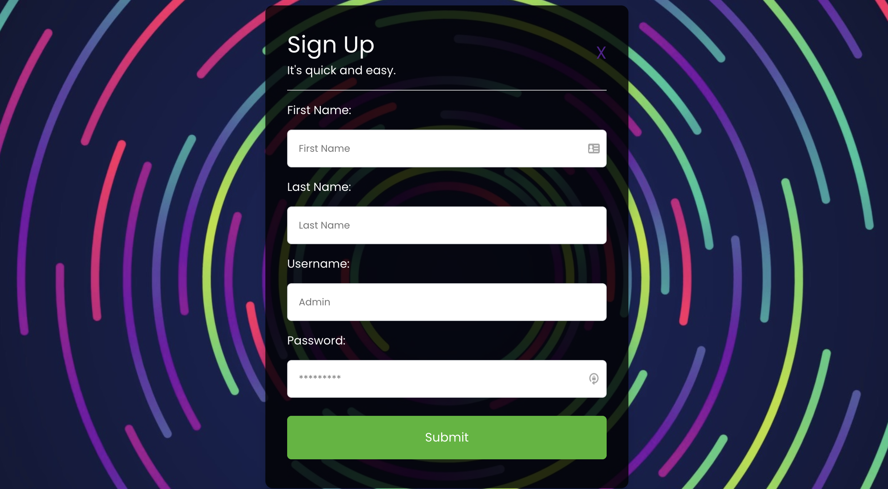
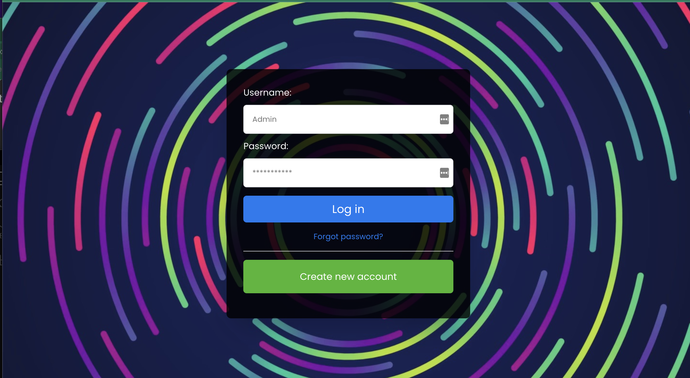

# Tocative

## Description 📖
Tocative allows users to chat with their freinds with the help of React. Users can message friends one-on-one or create a group chat with multiple friends. Users can search friends with username, add them and get to chatting.

## User Story ✍🏼
As a social person,
I want to conveniently message my freinds,
So that I can give and receive information conveniently.

## Screenshots
* Register Page

* Login Page

## Technologies
* CSS
* React
* JavaScript
* Apollo

## Challenges
Getting the chat functionality proved to be very difficult. It was also a challenge to implement the create room function up and running.

## Successes
Came out knowing a lot more about React. It will be easier to get better at it going forward.

## Contributors
* Seve Palattao
* Kip Schetnan
* Jesus Hernandez
* Kallie O'Gara
* Seeha Sangwang

## LICENSE 🔑
This project is licensed under the MIT License - see the [LICENSE](LICENSE) file for details